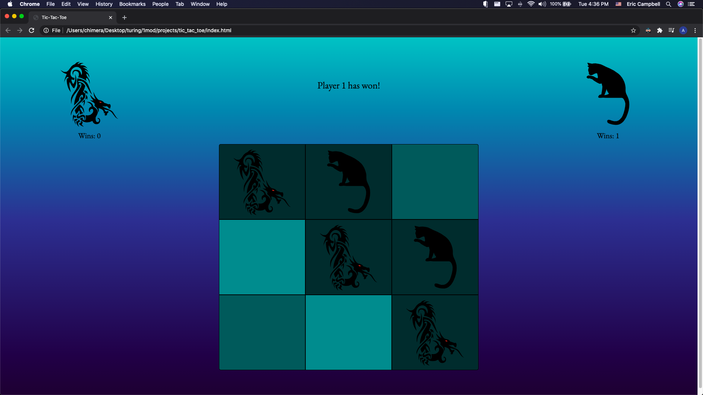
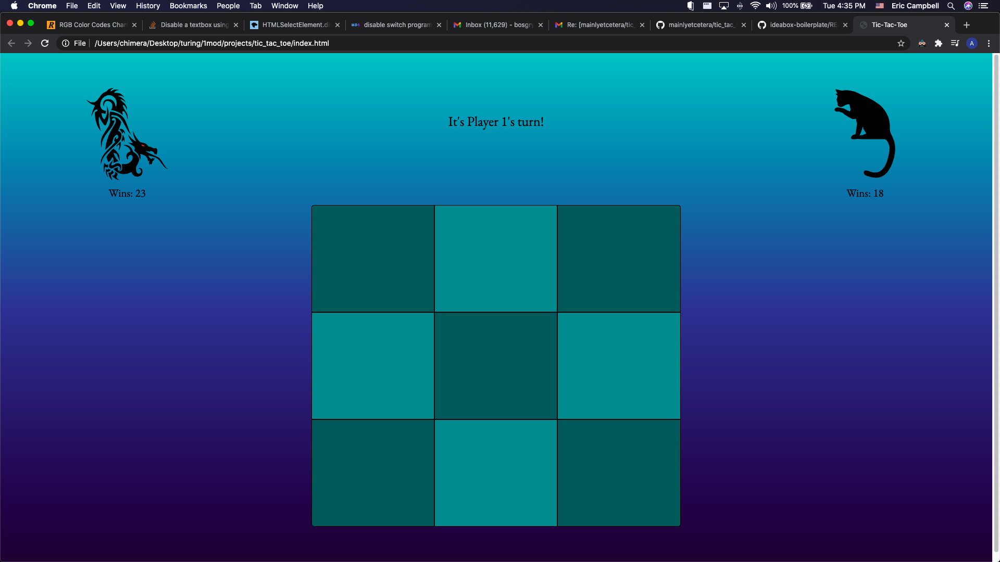

# Tic_Tac_Toe - CATS AND DRAGONS!

#### Choose a side in this epic rendition of the classic game!

---

## Table of Contents

- [Introduction](#introduction)
- [Features](#features)
- [Technologies](#technologies)
- [Architecture](#architecture)
- [Demonstration](#demonstration)
- [Deployment](#deployment)
- [Author](#author)
- [Challenges](#challenges)
- [Wins](#wins)
- [Contributors](#contributors)

## Introduction

The aim of [Tic-Tac-Toe](https://github.com/mainlyetcetera/tic_tac_toe) is to enjoy the classic game of tic-tac-toe with a twist! Your pieces are dragons and cats!!

[Here](https://frontend.turing.io/projects/module-1/tic-tac-toe-solo.html) are the basic specs for the game.
---

## Motivation

The motivation for this project was to put together everything I learned in Module 1. From `event delegation` to *writing dry code*, everything was to come into play here.

---

## Features

- [Play Tic-Tac-Toe](#Play-Tic-Tac-Toe)
- [Enjoy your cats and dragons!](#Enjoy-your-cats-and-dragons!)
- [Keep track of your wins!](#Keep-track-of-your-wins!)
- [Keep track of your wins even if you refresh the page!](#Keep-track-of-your-wins-even-upon-refresh!)

#### Play Tic-Tac-Toe

Enjoy the classic game of Tic-Tac-Toe!

#### Enjoy your cats and dragons!

Now your game pieces are **CATS** and **DRAGONS**!! No more boring `X's` and `O's`. Tic-Tac-Toe just leveled up!

#### Keep track of your wins!

Relax as the game keeps track of your wins for you! No more dispute with your friend as to who is the champion!

#### Keep track of your wins even upon refresh!

No, your opponent cannot hope to refresh the page and see the counts disappear! Continue to show your dominance through a page refresh!

---

## Technologies

1. JavaScript ES5
2. CSS3
3. HTML
4. Github
5. Chrome Developer Tools
6. Firefox Developer Tools

## Architecture

The overall architecture for this project is:

- 1 **HTML** file housing the components of the page
- 3 **JavaScript** files handling all functionality
  - these files are all housed in a *src* directory
- 1 **CSS** file handling the styling
- 1 *assets* directory holding the images that became the game pieces

### Reasoning for Architecture

I felt one **HTML** and **CSS** file was sufficient as there is currently only one page in the project. Perhaps when I add to the project, it may be worth adding more pages here to help handle that load. I used three JavaScript files:
  1. `player.js`
  1. `game.js`
  1. `main.js`

One of the main goals of the project was to cleanly separate the data model and the DOM. These three files reflect this goal. The game involves two classes, the `Player` class and the `Game` class, and `game.js` and `player.js` existed to house those classes. Together these files held the entire *data model* for the game. My goal was to be able to run the entire game from the console using only methods from these two classes. The `Game` class held the majority of the game's functionality, while the `Player` class held a smaller portion. The `Player` class allowed for the creation of `Player` instances that the game could use. It also allowed me to save the wins and win counts of the player instances via *local storage*, another key feature of the application. The `Game` class held the methods to place pieces on the game board, declare a win or draw depending on the order of the pieces, and start a new game once the current game had concluded. Upon a game's conclusion, the `Game` class ran a method telling the `Player` instances to save the board and increment their win count in the event that that player won. Of course, since at this point the game existed only in the data model, there were several `console.logs` to allow me to see if my game was working!

On the other hand, `main.js` existed to house all *DOM-related* JavaScript. This code existed to make the entire data model interact with the page itself. All data manipulation was handled from `game.js` and `player.js`, while `main.js` handled the display of all data on the page and allows a player to interact with a visual board. It is something of an illusion: the player feels they are adding pieces to the board they see on the page, but `main.js` is actually telling the page to add add and remove data from the current game instance, so it is still being manipulated from `game.js`. `main.js` is then looking at the board as it exists and displaying it instead of directly adding the pieces itself.

The order of the files, at least in terms of the `<script>` elements in `index.html` is significant. `player.js` is first because it does not require any info from any other file. It could stand on its own. `game.js` needs to succeed `player.js` as `game.js` needs it in order to make the **Player** instances. Finally comes `main.js`. The DOM-related file needs data from both the **Player** and **Game** classes, so it must come last. This ensures that each file has access to the data it needs to function!

In summary, `player.js` created the *Player* class used by the *Game* class in `game.js`. These files together formed the entirely of the data model, and the game could be completely played out of the console by manipulating the data of the *Game* instance. Then I used `main.js` to handle all *DOM-related* JavaScript. `main.js` was responsible for displaying all data and allowing the user a GUI with which to interact with the game, even though all data manipulation was handled between `game.js` and `player.js`.

## Demonstration

## Deployment
### https://github.com/mainlyetcetera/tic_tac_toe

## Challenges

- accepting event delegation instead of my comfort level of a multitude of query selectors
- adding the disabled tag to HTML elements with JavaScript
- making checkForWin functions take parameters to be D.R.Y.

## Wins

- reaching out to my mentor for help instead of struggling with challenges too long!
- found several opportunities to reuse functions, keeping the code as D.R.Y. as I could
- created an entire app by myself!
- overcame a couple bugs that were the result of event delegation, allowing for oddities when clicking right on the edge of the game board

## Future Features

`Just a few ideas for the future:`

- allow players to easily choose their own player icon
  - update player icons displaying on main page to reflect that
- allow players ways to choose who goes first, like flipping a coin or guessing a number
- switch the background view on command
- place a random piece at the beginning of the game
- set up timers so players only have a few seconds to make a move!
- put in more imaginative win messages
- have pieces fade in and out

## Author
<table>
  <tr>
    <td> Eric Campbell <a href="https://github.com/mainlyetcetera">GitHub</td>
  </tr>
<td></td>
</table>

## Contributors

##### Thank you for your contributions!

- For his help and constant sanity checks: <a href="https://github.com/Josephhaefling">Joe Haefling</a>
